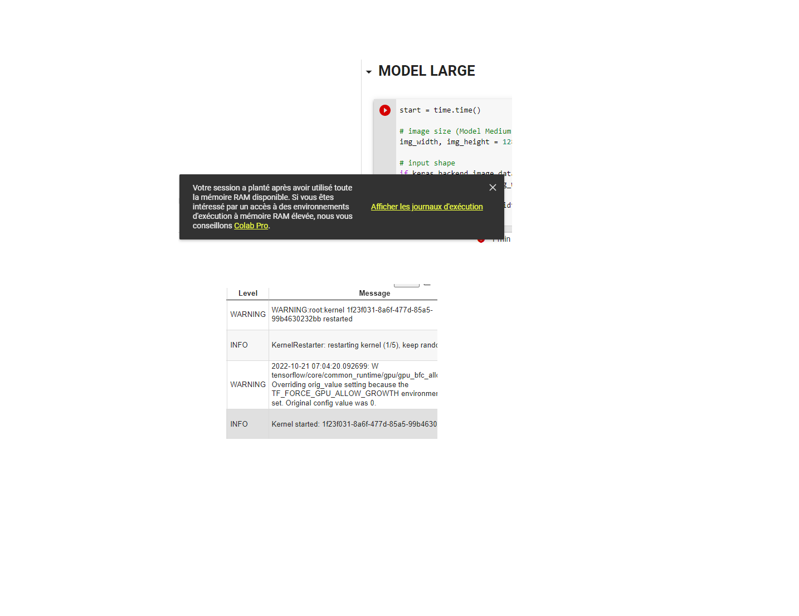
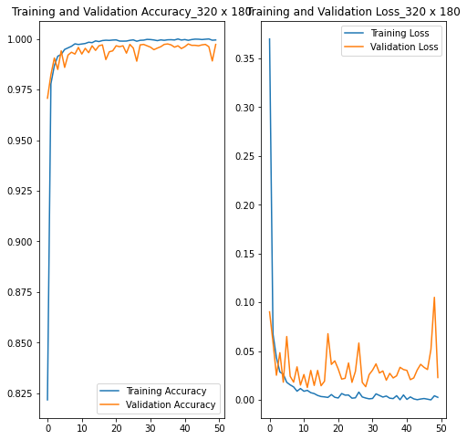
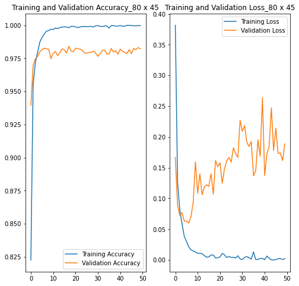
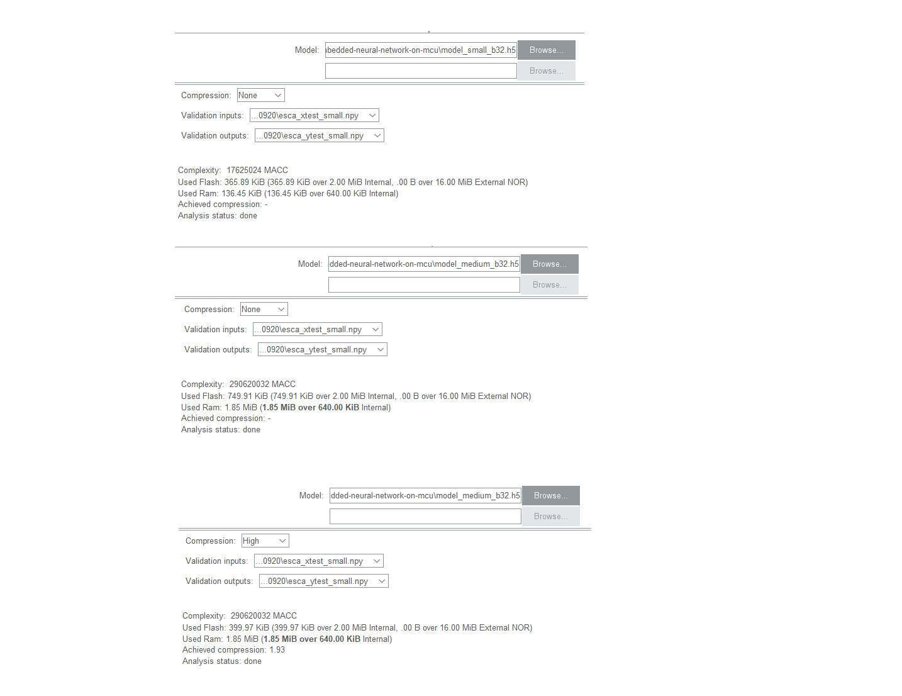
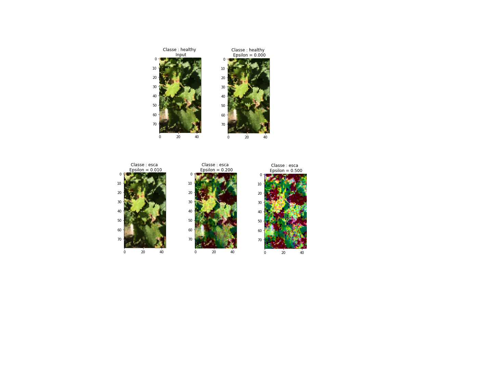

# Embedded Neural Network on MCU


## A. Introduction au projet 
Dans le cadre de la troisième année d’études à l'École Nationale des Mines de Saint-Étienne, cycle ISMIN, j’ai eu l'occasion d'assister à des séances de Travaux Dirigés. Ces dernières s’appuient sur les connaissances acquises lors des TP et du cours de Machine Learning.

## B. Problématiques et finalités du projet
Les principales problématiques qui se posent sont toutes liées au dimensionnement du modèle et à la 
taille des images. Progressivement, nous allons détailler, au fur et à mesure de l’avancement dans le document, ces parties plus délicates. 

## C. Modèles CNN et dimensionnement pour carte Discovery Kit 
## Génération de modèles et résultats
Grâce aux fichiers `esca_CNN.py`, `data_augmentation.py` à partir des ressources `.ipynb`, et aux répertoires `dataset`, nous avons obtenu des modèles dimensionnés avec des données différentes. Ces derniers servant à la classification binaire, il faut que l'apprentissage soit supervisé. Ainsi, nous avons partitionné le dataset obtenu avec augmentation de données en 3 dataset : ensemble d'entraînement à 60%, de validation à 15%, et de test à 25.  
#### Modèle large
Concernant le modèle large avec des dimensions d'image fixés à `(1280,720)`, le modèle obtenu a au total 1,886,466 paramétres entraînables, d'après le retour de ```model.summary()```. Même en optimisant la taille du batchs pour minibatch SGD et avec seulement _2_ epochs, nous obtenons une erreur à l'entraînement due aux dépassement de RAM de la session Colab. 
  

### Modèle medium
Nous obtenons avec modèle medium qui prend en entrée des images au format ``(320,180)`` les résultats qui figurent ci dessous. A la dernière epoch, dans le cas de l'entraînement, la loss vaut 0.0027, et l'accuracy vaut 0.9995. Dans le cas du dataset de validation, la loss est à 0.0230, et l'accuracy est à 0.9973. La test loss du label esca vaut 0.9936, et la test loss de celui healthy vaut 0.08047.
#### - Graphiques des fonctions loss et accuracy pour le modèle medium
 

### Modèle small
Pour le model small dont le format des images est ``(80,45)``, les résultats de l'entraînement et de la validation sont représentés ci-dessous. Les courbes de loss et d'accuracy correspondant à la 50ème epoch respectivement aux valeurs : 0.0019 ; 0.9998 pour l'entraînement et 0.1887 ; 0.9823 pour la validation.
Pour le test, le scalaire de la loss de la sortie esca est 0.9773, et celui de la loss de la sortie healthy 0.2730456590652466.
#### - Graphiques des fonctions loss et accuracy pour le modèle small
 

- [ ] En guise de conclusion, si le modèle est de plus grande taille et de génération plus chronophage, les résultats de l'entraînement et de la validation meilleures, et la prédiction des images de test est plus exacte.  


## Chargement des modèles sur la carte 
### Modèle small
Nous configurons le modèle model_small_b32.h5 en modèle enregistré Keras, et nous lançons l'analyse. Le nombre total d'opérations MultipliateACCumulate est de 17,625,024. La taille de la mémoire flash utilisée vaut 365.89 KiB et celle de la ram vaut 136.45 KiB. La mémoire flash disponible étant 2.00 MiB, il n'y a pas besoin d'utiliser la mémoire externe NoR flash de 16 MiB. La capacité de la mémoire RAM est de 640 KiB, le modèle small peut être chargé, par lancement (Run) après génération du code (Generate Code), sans aucun paramétrage supplémentaire.

### Modèle medium
En analysant le fichier model_medium_b32.h5, le résultat est que le réseau a une complexité qui vaut 290,620,032 opérations macc. L'espace de la mémoire flash nécessaire est de 749.91 KiB inférieur à 2 MiB alors que la zone occupée dans la Ram est de 1.85 MiB et dépasse le stockage disponible qui est de 640 KiB. Avec les options de compression, seul la taille de la flash est diminuée - jusqu'à 399.97 KiB en compressant avec `compression : High, achieved compression : 1.93`.  

 

Nous pouvons lancer le projet avec des options d'optimisation modifiées afin de diminuer la taille du programme. En sélectionnant les propriétés du `C/C++ Build` nous fixons le niveau d'optimisation à `-Os` pour `MCU GCC Compiler`. En lançant projet post-build, nous obtenons, comme erreurs `...region RAM' overflowed by 1286772 bytes` et `...region RAM' overflowed by 1286888 bytes`, respectivement avant et après changement des règles de compilations. Nous en déduisons que la diminution du modèle à la compilation ne permet pas de le rendre adapté à la board.


## D. Communication CNN-Disco et inférences
### Communication entre Disco board et NN
Nous utilisons le code fourni `Communication_STM32_NN` et `Application X-Cube AI` pour efeectuer linference sur la carte. En vue de cela, nous avons modifié le fichier `app_x-cube-ai.c` fourni par le AI Software Pack après avoir généré le code. Il faut ajouter les deux fonctions prédéfinis et qui sont : `acquire_and_process_data(ai_i8* data[])` et `post_process(ai_i8* data[])`. En s'appuyant sur le fichier fourni, la matrice `input` doit être de taille `img_height`x`img_width`, et la portée des boucles `for` imbriquées doit se limiter au `img_height` et `img_width`.  Une fois le projet compilé puis lancé, en debug ou non, sans erreurs ni avertissements, la carte est programmée avec le modèle cnn qui correspond au variables `img_height`, `img_width`.  
### L'inférence sur cible Disco board
Pour tester le modèle sur la carte, nous utilisons les ensembles `esca_xtest_small.npy` et `esca_ytest_small.npy` relatifs au `test_dataset` du 		
modèle small. Le fichier `Communication_STM32_esca.py` permet l'inférence sans synchronisation puisqu'elle bloque souvent l'envoi des données. Nous avons également ajouté une dimension à la valeur 3 au paramètre de la méthode `reshape` compte tenu des images RGB entrées. Nous adaptons également les indices des boucles for et les tailles des tableaux et matrices utilisés. Après avoir lancer le fichier, à chaque inference une image aléatoire est choisie et son label esca ou healthy est comparé à la valeur 0 ou 1 prédite par le modèle. A la fin des inférences définies par `nb_inference`, nous obtenons le nombre d'erreurs du modèle et la durée totale de l'inférence. Nous remarquons que la valeur de cette durée est autour de 50 secondes et que l'erreur est approximativement égale à la moitié du nombre d'inférences.

```
----------- Inference 0 requested: -----------

Chosen input's corresponding label is esca according to y_test


STM32:
Obtained probabilities: 
[[2.97082437e+38 2.97079192e+38]]
Model prediction is [0] with probability [2.97082437e+38]

***** Prediction matches with y_test label
```

## E. Modèle avec exemples adverses à l'inference 
#### 
### Modèle de menace
Dans notre cas d'étude :

-  le but de l'attaque avec les exemples adversarial est de tromper le modèle en faussant le résultat prédit. 

- Notre connaissance du modèle est WHITE-BOX et notre capacité d'attaque est double (à l'entraînement et au test), puisque nous avons accès à la structure interne du modèle et aux données de test et de train. 

- Du point de vue du défenseur, nous pouvons supposer que le modèle peut être mieux défendu en l'entraînement sur des données adverses labellisées de façon supervisée. 

- Notre système est du type API, basé sur le déploiement en séparant entraînement et inférence.

-  Le réseau est facilement clonable, étant donné que le code n'est protégé que par licence et par la suite, l'attaque est adaptative (soit en connaissant le modèle par copie du réseau, ou soit l'attaque d'un des collaborateurs à l'élaboration du code).
### Inférence adverse au niveau des modèles
Quant à l’inférence adverse du modèle, il est possible de modifier les dimensions de l’image, afin de voir la différence après perturbation. A partir du modèle `model_small_b32` et d'une image test  du répertoire `healthy_000_cam3` converti en .npy, nous créons 4 images avec quatres valeurs de bruit, qui sont comprises entre 0 et 0.5. En testant avec les 5 images dont l’image d’origine, que nous passons en entrée du réseau nous obtenons les prédictions qui figurent ci-dessous. Nous constatons que dès la deuxième valeur du poids de la perturbation (`epsilon`), la prédiction du modèle est faussée. Au fur et à mesure que la valeur de ce poids devient plus grande, l’image est plus bruitée et la confiance du modèle en la prédiction obsolète augmente. 

#### - Résultats de l'attaque adverse : healthy, healthy, esca, esca, esca
 

### Inférence adverse sur Disco board
Par contre pour le test sur la cible, nous avons pris en compte que le modèle small et ses paramètres d’images, vu que le modèle large peu entraîné ne peut pas être compilé, et que le modèle medium compressé ne s'insère pas sur carte.
Nous avons utilisé les fichiers `adverse_ecsa.py` et `communication_STM32_esca_adverse.py` pour effectuer l'inférence en mode adverse. Nous avons testé le modèle en adverse sur la carte avec uniquement la dernière valeur de perturbation qui vaut 0.5. Les inférences sont toujours effectuer aléatoirement, en faisant qu'une seule inférence aléatoire, nous obtenons ci-dessous le log de celle-ci. La confiance du modèle en la prédiction [0] ou `esca` vaut 4.4257489e+39 et celle en la prédiction [1] ou `healthy` vaut 4.425740e+39, alors que le label de l'image correspond à [1]. Notons qu'il est possible d'améliorer les prédictions du modèle en mdoe adverse en modifiant le dataset d'entraînement de sorte qu'il inclut des images bruitées avec les labels adéquats.

```
----------- Inference 0 requested: -----------

Chosen input's corresponding label is healthy according to y_test


STM32:
Obtained probabilities: 
[[4.42574897e+39 4.42574007e+39]]
Model prediction is [0] with probability [4.42574897e+39]

***** Prediction does not match with y_test label
```


## F. Conclusion et références 
Durant les travaux pratiques, nous avons pu faire le lien entre les connaissances pratiques et théoriques en intelligence artificielle. Le projet nous a donné l'opportunité d’exercer les méthodes de machine learning en particulier le dimensionnement de modèles cnn, l'inférence sur carte, et la sécurité/l'attaque de réseau.


- [ ] [A grapevine leaves dataset for early detection and classification of esca disease in vineyards through machine learning](https://www.sciencegate.app/document/10.1016/j.dib.2021.106809)
- [ ] [LDD: A Dataset for Grape Diseases Object Detection and Instance Segmentation](https://deepai.org/publication/ldd-a-dataset-for-grape-diseases-object-detection-and-instance-segmentation)


